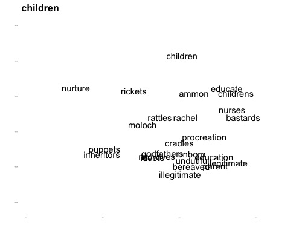
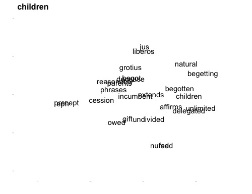

### Introduction
This page provides supplemental information and a walkthrough tutorial to accompany the essay, "A Mathematical Theory of Authorial Intention." 

First off ... **Thank you so much for reading!** I know the essay is difficult and strange, but it was incredibly fun to write, and I'm so excited to see it finally out. Thanks for taking the time to learn more about the work. Please know that you are absolutely welcome to contact me with questions. Even if your question(s) seem(s) silly or mundane or intrusive. Trust me -- I'd love to hear from you! 

This tutorial is meant to serve three different purposes:

1. For people really interested in the data itself, it'll provide  all the details and full access.
2. For the DH-curious, it will give a glimpse of what this kind of work looks from 'behind the scenes'.
4. For me, it'll sketch out a few things I wasn't able to mention in the essay.


### Setup and Data Loading
If you're just reading this online, you don't need to do anything. But if you'd like to follow along or do some of this work yourself, you'll have to download some stuff.

What you have to download will depend on what you want to do. If you only hope to recreate the graphs on your own machine and you're content with very little independent experimentation, everything you need is available in the `intention` R package, which can be downloaded and installed from Github.

Assuming that you have R installed and the `devtools` package loaded (as well as the `ggplot2` and `Matrix` packages), you can get everything you need by running this command:

```r
devtools::install_github("https://michaelgavin.github.com/intention")
```

Because the data files in the `intention` package are pretty big, it might take a while to download. Once it does, you need to activate the libraries in R:

```r
library(intention)
library(ggplot2)
library(Matrix)
```

However, as we'll see, the 3D tensor model I describe in the article creates really big files. You can't hold all of the data from the corpus in a single file, nor can it be imported all at once into your R environment. As a consequence, I store the data in separate word-context matrices for each document, and the analyses I describe in the article were all performed by scanning across those separately stored files to build composite matrices for analysis. Some of the data files included in this tutorial have already been compiled over the underlying dataset. The data isn't raw data, if by "raw" one means naturally occuring and untouched by humans. It's "raw" like food you buy at the grocery store is raw, which is to say, it's been thoroughly processed.

I'll explain more about this below. I mention it here only to explain why any scholars hoping to extend beyond this tutorial and play with the underlying data on their own will have to download the full dataset, which is several gigabytes and is stored on [Dataverse](https://dataverse.harvard.edu). The link to my particular repository is [here](https://dataverse.harvard.edu).

**NOTE TO PEER REVIEWERS: the full dataset isn't up yet (as of 08/25/2018) if you'd like access during the review process and it's still not available, please forward a request through the editor.**

### Figure 1. The 3D Model
The key technical innovation -- or, if not an *innovation* per se, at least the thing that makes what I'm doing in the article really different from other computational research that I know of -- involves the basic data structure. I represent a corpus as a three-dimensional array of data. Here's the image from the article:


In the 3D model, each of the "dimensions" is a **vector space**. This array brings together the vector spaces of documents, words, and canonical features (keywords, in all provided examples). As I discuss in the article, this shape can be distorted or changed in various ways and indeed there isn't anything about the mathematical theory that dictates using exactly these dimensions. The only requirement is that each dimension must be consistently measureable across the others. 

What do I mean by "consistently measureable"? To get a handle on this concept, let's think of a matrix structure that wouldn't be compatible with a 3D array. You couldn't, for example, represent a document in the 3D model as a matrix of words and paragraphs. Although of course it would be possible to create such a matrix of any individual document -- with words for the rows and a column for each paragraph -- you couldn't compile those matrices into an array because the paragraphs in one document don't exist in any of the others. It's not just that they don't share the exact words, they are ontologically incommensurable. Obviously the first paragraph of *Robinson Crusoe* doesn't exist even once in *Gulliver's Travels*. But you wouldn't say that it appears zero times. That doesn't make sense. Try it:

> The first paragraph of *Robinson Crusoe* appears zero times in *Gulliver's Travels*.

It's sort of true, but it's also just nonsense. By definition, the first paragraph of *Crusoe* is in *Crusoe*, and not in any other document. Even if the first paragraph of *Gulliver's Travels* was word-for-word the same as the first paragraph of *Robinson Crusoe*, it'd still be a different paragraph. Identical, but distinct.

By contrast, words and keywords exist independently of any individual text. They are what they are, even across different documents and regardless of whether they appear in each. It makes perfect sense to say that *Robinson Crusoe* uses the word "presumptuous" zero times.

Anyway, *K*, *D*, and *W* must be commensurable, but they're by no means fixed. In the case studies below, you'll see I distort the 3D shape when measuring time by collapsing each document by year. [Elsewhere](http://culturalanalytics.org/2017/11/scotlands-poetics-of-space-an-experiment-in-geospatial-semantics/) I've experimented with replacing *K* with a list of geographical places. There really are all sorts of things you could do. I also mention a hypothetical study that would represent *K* as a list of canonical grammatical structures to see how authors distribute words differently across their syntax. You could work with a corpus of sonnets and represent *K* as a length-14 list of line numbers. It doesn't matter so long as the dimensions are mutually commensurable across all documents.

But for now let's follow the article in discussing the simplest and most common case, where *W* represents a list of words, *K* a list of high-frequency keywords, and *D* the list of all documents.

In this model, a vector can be specified when two of its dimensions are fixed and the third is treated as a sequence. So in the picture above, you'll see a purple prism running through the middle. That purple box represents a sequence of values **k** for a single word *w* in a single document *d*, where each value of **k** is the frequency with which that word appears near each keyword in that document.


### The EEBO data
Data for the article was collected during the year 2015, shortly after the release of the Text Creation Partnership's first (Phase I) batch of files. Because in my earlier life I was a scholar of Restoration and eighteenth-century literature, but also because spelling changes over the 1630s present difficulties for big longitudinal studies, I began by focusing primarily on documents published from 1640 to 1699. When I downloaded the files at the time, there were 18,311 files in the corpus from within that date range.

Building the vocabulary of words and keywords was in many ways the most important step in the research. This work supported a couple articles that I published before beginning the "intention" piece: one on [Restoration criticism](https://muse.jhu.edu/article/634558/summary) and another general introduction to [vector semantics](https://www.journals.uchicago.edu/doi/abs/10.1086/698174). Details for how the keywords and vocabulary were finally selected can be found [here](https://github.com/michaelgavin/empson/blob/master/building_eebo.Rmd). The most important things to know:

1. The vocabulary excludes a list of 876 stopwords, made up of a mix of high-frequency words and other oddities from the EEBO transcriptions. (The full list is included in the `intention` R package as the dataset `stopwords`.)
2. The vocabulary was built by looking at the 20,000 most frequent words (excluding stopwords) from every year. 
3. The keywords were chosen if they were among the 5,000 most frequent words *every* year, resulting in about 2,000 high-frequency words.

Of these things, the most important issue is the first: the stopwords. A year or so after finishing the data work for the "intention" piece I applied the same principles to a different, smaller corpus, and chose not to exclude stopwords. The problem was that in many cases the conceptual work scores came out all screwy, usually showing the highest work for function words like prepositions and pronouns. So, I tried a couple different normalization techniques, TFIDF and PPMI, but those placed so much weight on low-frequency words, that conceptual work basically just mirrored them.

This means that if you're the kind of scholar who's bothered by stopwords and would like a mathematical theory of meaning to avoid using them, work remains to be done to flesh out the theory. I provide a sketch of one possible direction for such work below, in the discussion of Figure 4.

### Data in the package
If you've installed R and the `intention` R package, you'll have access to several important pieces of data.

1. `eebo` is the word-context matrix, *V(W, K)*, representing the elementwise sum of every *D(W, K)*.
2. `deebo` is the word-document matrix, providing the values of *F* for each document.
3. Sample document-level word-context matrices are provided for the following EEBO-TCP files: `A26981`, `A27301`, `A36106`, `A36643`, `A43998`, `A48901`, and `A50919`.
4. `natlaw`, the composite matrix of works similar to Locke's *Treatise*.
5. `behn`, the composite matrix of Behn's works.
6. `teebo`, a matrix compiled by year, 1640 to 1699.

There are also a few other items included that aren't in matrix format. The items `averages` and `deviations` include some statistics compiled over the full data, `behn_ids` and `locke_ids` contain the TCP id numbers for the items in those subcorpora, and the `vocab` and `keywords` vectors are also in there.

#### Functions in the package
The functions in the package follow what's described in the article. I wrote the R functions to mimic as closely as possible the mathematical expressions.

1. `semantic_distance()` measures the cosine distance that separates any two vectors of numbers.
2. `conceptual_work()` is an embarrassingly simple function. It just multiplies two vectors together.
3. `semantic_transparency()` calculates the entropy of a vector, taken to the base of that vector's length.
4. `set_threshold()` draws a normalization curve over a set of averages and standard deviations.
5. `conceptual_word_adj()` calculates normalized conceptual work by adjusting each value to the threshold.

I also borrow a couple functions from my old `empson` package for computing over matrices:

6. `similarity()` just iterates `semantic_distance()` over a matrix.
7. `similarity_map()` draws the word clouds used in the article.

Details of each function can be found in the documentation for the R package.

### Figure 2. Word deviance and frequency in a simulated document
Creating the simulated document is a fairly complicated process, the details of which are largely irrelevant to the argument of the essay. For readers interested in the details of its creation, I wrote a separate guide just for Figure 2. You can read it [here](https://github.com/michaelgavin/intention/blob/master/figure2.Rmd).

### Figure 3. 
First load the corpus-level data. Because they're big files, they're stored as 'external data' in the package, which means the command to load them is just a bit more complicated than for the other data items.
```r
load(system.file("extdata", "eebo.rda", package = "intention"))
load(system.file("extdata", "deebo.rda", package = "intention"))
```

Now load the data for an individual document and compare:
```{r]
data("A48901")
# Now calculate delta for each word
delta = c()
for (i in 1:nrow(m)) {
  delta = c(delta, semantic_distance(m[i,],eebo[i,]))
}
delta[is.na(delta)] = 0
```

Now get the frequencies and compare them.

```r
# Get the frequency and calculate work
freqs = deebo[,"A48901"]
c_work = conceptual_work(freq = freqs, cos_dist = delta)

# Filter out the vocabulary and plot words used in the document
ord = which(freqs > 0)
plot(freqs[ord], delta[ord], type = "p", pch = 20, col = "gray")

# Select the twelve hardest workers and print them as labels
hits = order(c_work, decreasing = T)[1:12]
text(freqs[hits], delta[hits], labels = names(c_work[hits]))
```


The same process can be repeated for each chart in Figure 3. Document matrices are available for the following: `A26981`, `A27301`, `A36106`, `A36643`, `A43998`, `A48901`, and `A50919`.

Feel free to play around with the data a bit. For example, to see the scores for conceptual work for each of the top 12 terms:

```r
sort(c_work, decreasing = T)[1:12]
```

To calculate the transparency:

```r
semantic_transparency(c_work)
```

It's fun, too, to just play around with semantic similarity to see how it functions in different contexts. So, you can see how Locke construes "children":

```r
similarity(m, "children")
```

Then look at how Richard Baxter construes children:

```r
data("A26981")
similarity(m, "children")
```
"Why chickens?" you might be wondering. It comes from Baxter's paraphrase of the Gospel of St. Luke, chapter 13 verse 34:

>  O sinful, miserable Jerusalem! How ost would I have gathered thy whole City and Nation (old and young) into my bosom of Love, and my Church, by making you my Disciples, as tenderly as a Hen doth gather and love her Chickens, not casting out your Children, but taking in your Nation, as God did before, if you had not cut off your selves by unbelief, and obstinate rejecting the Grace offered to your Nation?

This is one of the things that makes semantic modeling really fun. You are basically free associating over historical discourse and following writers over trains of thought that weren't necessarily even explicit to themselves. Baxter never said to himself: "I associate farms animals with domesticity and divine order" but it's a powerful line of thought that runs through much Christian commentary of the period.

### Figure 4. Word deviance and frequency over EEBO-TCP corpus.
This chart is my favorite one in the whole piece. I realize that for many readers the ideas will be blurring into each other at this point in the article, but this chart really strikes to the core idea of the theory.

Remember, the challenge of reading for intention is the challenge of attributing a meaning to an attribute. Typically as in Figure 3 we're working at the document level, and we want to differentiate meanings that are generated by the document from those that are inherited from elsewhere. When the data is really small -- when, for example, a segment of discourse is very short or a word is used just a few times -- then in the vast majority of cases such discourse isn't producing meanings at all. It's just selecting from a field of possible meanings. Other times, it's really pushing some idea in a strange way; it's producing a new concept or using an existing concept in a new way. 

If we're going to attribute a meaning to an attribute -- in Figure 3, we're attributing meanings to the TCP number, though I cheat in the article itself and pretend I'm attributing them to authors in the more conventional sense -- we need some theoretical mechanism for differentiating such cases. The whole point of Figure 4 is to articulate a framework for making this distinction, and it lays out something like a general law for how words and documents function in the intellectual history of concepts.<sup>1</sup>

Stated in prose, this law says that semantic deviance correlates powerfully with word frequency. Words used just once or twice are unlikely to correspond closely to the patterns of use over the full corpus. Words used frequently tend to veer towards the norm. However, those norms exist categorically, not really, and individual cases will always vary from them. *To characterize the meaningfulness of a statement is to describe its position along a curve of semantic normality.*


In real life, we do this all the time. We have to decide whether the discourse that presents itself to us is doing so using concepts we already know or whether it's really trying to push something new. Usually it's not. To understand people is mostly just a matter of matching what they say to ideas you're already carrying around up in your own mind. Sometimes, though, it doesn't work that way. Every time you interpret any statement -- whether that statement is part of a conversation or a line of a poem or some goofy essay about the theory of authorial intention -- you're making these kinds of judgments. To describe the meaning of a statement is to triangulate between the meanings that seem to be expressed and the meanings inherited from elsewhere. "Normalized conceptual work" creates a baseline estimate for making such judgments in the context of corpus analytics.

What makes this graph potentially confusing is that it looks very similar to Figure 3, but it's calculating something very different. The x-axis shows all frequencies from 1 to 1,000. The y-axis shows the average semantic deviance for every word in every document used at that frequency.

What are all the words Locke uses exactly 7 times? On average, what's the semantic deviance that separates their vectors from the corpus-level vectors? What about other documents that use words exactly 7 times? Or 17 times? Or 717?

(If you have any experience with network science, you can think of the x-axis of Figure 4 as showing something like the degree distribution for nodes in a network.)

What's weird about this is that the points in Figure 4 don't correspond with individual words, like the points in Figure 3 do. Instead, they abstract over every document that uses any word at a given frequency level. Any time any document uses any word 7 times, the deviance is compared to all the other times documents used words 7 times. That average is the y-axis of Figure 4.

Calculating all these semantic distances takes a long time. **Don't try this at home!** (unless you don't need to use your computer for a few hours.) However, here's the full script for reference. -- I won't describe it step-by-step here. Email me if you have any questions or if you find any mistakes.
```r
mat_loc = "/home/mgavin/EEBO-RDA/"

filenames = paste(mat_loc, ids, ".rda", sep="")

cos_sim = function(x,y) {
  return((x %*% y) / (sqrt(x %*% x) * sqrt(y %*% y)))
}

distances = matrix(0, nrow(eebo), length(ids))
colnames(distances) = ids
rownames(distances) = rownames(eebo)

for (i in 1:length(filenames)) {
  print(i)
  id = ids[i]
  load(filenames[i])
  vec = c()
  for (j in 1:nrow(m)) {
    distance = 1 - cos_sim(m[j,], eebo[j,])
    vec = c(vec, distance)
  }
  distances[,i] = vec
}

# Now need freq averages and deviations
hits = which(deebo > 0)
frequencies = deebo[hits]
dist_vec = distances[hits]

n = 1:max(frequencies)
averages = c()
deviations = c()

for (i in 1:length(n)) {
  print(paste(i, "of", length(n)))
  ord = which(frequencies == i)
  averages = c(averages, mean(dist_vec[ord], na.rm = T))
  deviations = c(deviations, sd(dist_vec[ord], na.rm = T))
}
```
For anybody working with the `intention` R package, the `averages` and `deviations` objects are saved and ready to go. So you can just load them into your R environment.

```r
data(averages)
data(deviations)
```

We need to calculate the values for variables in the following formulas:


and 


Where bar-delta in the first formula is the `averages` vector and little-sigma in the second formula is the `deviations` vector.

These take the form of a linear model in which one of the variables has been transformed by the logarithm. I knew a regular linear regression model wouldn't fit this data, and I knew that what I wanted was a nice little line swooping through the middle like the Nike swoosh, just as the dashed line in Figure 4 swooshes. (From my reading in the field of statistics I have learned that "swooshes" is the technical term.) So I did what any self-respecting data researcher does: I stole code from StackExchange and repurposed it for my data. The webpage I borrowed the code from is [here]("https://stats.stackexchange.com/questions/176595/simple-log-regression-model-in-r"). 

A log-linear model takes the form *y = ax + b* but the value of *x* has been log transformed to account for the way the curve flattens as it extends to higher values. Using the `lm()` function in R for drawing linear models, the function uses a least-squares method to estimate the y value for each point along the x-axis. In the `intention` package this is all built into the `set_threshold` function, but here's the relevant code:

```r
x = 1:length(averages)
fit = lm(averages ~ log(x))
```
The `lm()` function estimates the slope and intercept for the linear model. To see how they plot on the y axis, you plug those values into the *y = ax + b* formula (remembering to log-transform x).

```r
y = (fit$coefficients[2] * log(x)) + fit$coefficients[1]
plot(x[1:1000], y[1:1000], ylim = c(0,1))
```


I like to call this the "curve of semantic normality." It shows a general model for the relationship between a word, a document, and a corpus.

This curve is used as the basis for setting a threshold of semantic significance. The linear model takes this form:


and it's represented in the commands below using this line of code:

```r
curve_of_semantic_normality = threshold$delta + (threshold$mu * threshold$psi)
```

The variable mu is set by the researchers based on their judgment and based on how they plan to paraphrase the output of the model into descriptive prose. In most situations, I suggest, they'll either want to use *mu = 0*, which just represents each instance of conceptual work against the average, or empirically using this formula:


which scales the threshold to its first value, under the assumption that any time a document uses a word just once, the author must presume that the word's meaning is inherited from outside the document itself. This presumption is of course never absolute, but nonetheless seems pretty trustworthy to me. In the `set_threshold()` function, any time the `mu` argument is left NA, the parameter is automatically calculated using this parameter.

Quickly, to see how the above formula reduces:


then simply plug the formula in for mu:


and solve for theta


It's possible to plot these relations for each document, as in Figure 3, but an alterative line of research would be to plot these relations for each word. How does the shape of the curve vary from word to word? Which words are flattest, meaning that they tend to consolidate around a single coherent use pattern? Which words are tallest, with the highest level of variation?

The mathematical theory of intention predicts, I believe, that the curve will be flattest for monosemous terms (that is, words with pretty much one meaning) but taller for polysemous nouns, modifiers, and verbs, and tallest by far for function words (prepositions, pronouns, and articles).

There are many possible extensions of this line of research, but one refers back to the question of stopwords, mentioned above. If it's right that different kinds of words are shaped differently, comparing the curve for each word against the normal corpus-level curve could differentiate stopwords. Under this model, high-frequency words could be kept in if they are semantically invariant but tossed if they display wide variation at high frequencies. (Such variation would suggest that prevalence of the term does not correlate to the other semantic content of the documents.) 

In practical terms, this would allow us to develop a rigorously conceived method to keep high-frequency words that carry a lot of semantic weight (in EEBO, this'd be words like "god") but that get thrown out by methods based simply on document frequency. Right now we just have to curate the stopwords more or less by hand.

In theoretical terms, this would help us begin to formalize what we mean by stopwords themselves. What does it mean for words to perform more or less conceptual work? How should we orient our understanding of literary history and corpus linguistics accordingly?

## Figure 5. Milton and Dryden
The charts in Figure 5 are the same as those of Figure 3, but with the normalization curve layered on top to show which words make "the cut." Making the cut means that the use of the term in that document is so far outside normal bounds that it likely has some special meaning in the document, which differs substantially from its general meaning over the full corpus.

```r
threshold = set_threshold(avgs = averages, devs = deviations)

# Load Paradise Lost
data(A50919)

# Now calculate delta for each word
delta = c()
for (i in 1:nrow(m)) {
  delta = c(delta, semantic_distance(m[i,],eebo[i,]))
}
delta[is.na(delta)] = 0

# Get the frequency and calculate work
freqs = deebo[,"A50919"]
c_work = conceptual_work(freq = freqs, cos_dist = delta)

# Filter out the vocabulary and plot words used in the document
ord = which(freqs > 0)
plot(freqs[ord], delta[ord], type = "p", pch = 20, col = "gray")

# Select the twelve hardest workers and print them as labels
hits = order(c_work, decreasing = T)[1:12]
text(freqs[hits], delta[hits], labels = names(c_work[hits]))

curve_of_semantic_normality = (threshold$mu * threshold$psi) + threshold$delta
lines(x = 1:max(freqs), y = curve_of_semantic_normality[1:max(freqs)])
```


Repeat the same process for *Macflecknoe* (A36643).

## Section II: Applications
Now we're getting into the case studies, and the ideas expressed in the main text of the theory start to deform a bit. This process begins with the study of a single document, John Locke's *Two Treatises of Government* (A48901). After a brief digression, I provide the code below.

##### a brief digression

The fun thing about this first case study is that it's basically a stroll through the uncanny valley of digital literary studies. There a very strong assumption in quantitative analysis that what's being studied is a *real thing out there in the real world* and that the model is an *imperfect representation of that thing*. This assumption informs the famous aphorism, "All models are wrong," but it's a misundertanding of modeling's basic metaphysical problem. We might choose to imagine that a model is a representation of some real thing, but that's an ontological commitment we bring to bear on the object, not a property of the object itself.

This metaphysical problem in the epistemology of modeling is very similar to the problem that plagues twentieth-century debates on the topic of authorial intention. The quantitative theory obtrudes onto our awareness the process by which scholarship creates the objects to which we attach symbolic veridicality. By calling my essay a theory of "intention," I'm forcing this issue. 

What was fun about writing the Locke case study was the pleasure of scurrying around in the nooks and crannies of the space of this intellectual discomfort. On one hand, I unapologetically refer to my findings as representations of Locke's intent. (They're more trustworthy then any exemplary quotations *you* might choose.) On the other hand, it's inescapably obvious that the results are produced by the methodology, and it's exhilaratingly at odds with common sense that changing the corpus of comparison could change Locke's intentions. Yet, that's exactly what this first case study exposes.

digression concluded ...

### Table 1.1
The basic idea of this case study is to perform two related sets of comparisons. I want to compare Locke's *Treatise* to the EEBO model, as above, but I also want to parse it in a little more detail. Based on what data scientists lamely call my "domain expertise," I knew that Locke joined a vibrant field of debate around questions of natural law, and based on my (whaddaya call it?) "technical good guessery," I figured that it'd be trivially simple to recover documents in that field of debate by just finding those that use words in roughly the same proportion that Locke uses them. Once that subcorpus is identified, I triangulate the conceptual work scores for Locke against those of his peers.

To find the 100 documents most-similar to Locke's *Treatises*, run this command:

```r
locke_ids = similarity(deebo, "A48901", margin = 2, fullResults = T)
locke_ids = sort(locke_ids, decreasing = T)[1:100]
```
Note that Table 1.1 in the article ranks documents by *distance* but the function above returns *similarity*, so to reproduce the numbers in the table itself you'll have to run the command `locke_ids = 1 - locke_ids`.

If you have downloaded the full dataset, you could write a for loop that iterates over these id numbers, loading the 100 files one-by-one, and each time adding them to the subcorpus matrix. It'd look something like this.

```r
setwd("C:/Users/mgavin/Desktop/EEBO-RDA")
ids = names(locke_ids)
for (i in 1:length(ids)) {
  print(i)
  fp = paste(ids[i], ".rda", sep="")
  load(fp)
  if (i == 1) {
    natlaw = m
  } else {
    natlaw = natlaw + m
  }
}
```
Alternatively, you could just load the data from the `intention` package directly.

```r
data(natlaw)
```

### Table 1.2
Table 1.2 shows normalized conceptual work. To calculate that:

```r
data(A48901)
# Now calculate delta for each word
delta = c()
for (i in 1:nrow(m)) {
  delta = c(delta, semantic_distance(m[i,],eebo[i,]))
}
delta[is.na(delta)] = 0
locke_delta = delta
locke_freqs = deebo[,"A48901"]

```
Once you have *F* and *Delta* you can calculate the normalized conceptual work. In Table 1.2, I use a more relaxed threshold and set `mu = 0`.

```r
easy_threshold = set_threshold(avgs = averages, devs = deviations, mu = 0)
normed_work = conceptual_work_adj(freq = locke_freqs, cos_dist = locke_delta, threshold = easy_threshold$theta)
```
And you can calculate the same thing for the `natlaw` matrix and compare to Locke.

```r
# First save Locke's conceptual work (not normalized)
locke_work = conceptual_work(freq = locke_freqs, cos_dist = locke_delta)

# Then recalculate delta over the natlaw word-context matrix
delta = c()
for (i in 1:nrow(natlaw)) {
  delta = c(delta, semantic_distance(natlaw[i,],eebo[i,]))
}
delta[is.na(delta)] = 0
natlaw_delta = delta

natlaw_freqs = rowSums(deebo[,locke_ids])

natlaw_work = conceptual_work(natlaw_freqs, natlaw_delta)
```
And here we encounter the first place where it's necessary to improvise beyond the ideas articulated in the first section of the essay.

We want to characterize how Locke deviates from his peers. We begin by comparing the `A48901` matrix to `natlaw`.

```r
# Then recalculate delta between the locke and natlaw matrices
delta = c()
for (i in 1:nrow(natlaw)) {
  delta = c(delta, semantic_distance(m[i,],natlaw[i,]))
}
delta[is.na(delta)] = 0

locke_to_natlaw = delta
```
We could calculate conceptual work as above by simply multiplying `locke_to_natlaw` with `locke_freqs`. But what we're interested in here is not so much the conceptual work of Locke's *Treatises* as in identifying the points where Locke's work deviates most powerfully from EEBO, compared to his peers' deviation from EEBO. 

```r
triangulated_deviance = locke_delta - (locke_to_natlaw + natlaw_delta)

# Then calculate work, as above
triangulated_work = triangulated_deviance * locke_freqs
```

This calculation is important to the argument because it's the first glimpse at how the procedures described in the opening section can be modified while staying true to the core principles of the theory.

### Figure 6. "Children" in Locke and EEBO
Creating these charts is really easy in the R package. Just run these commands.

First over the full EEBO model.
```r
similarity_map(eebo, "children", numResults = 25)
```




Then over the model of Locke's *Treatises*.

```r
similarity_map(m, "children", numResults = 25)
```


## Aphra Behn
The model of Aphra Behn's works was compiled just as the `natlaw` model above, but using works with Behn listed as first author. There were 45 such documents in the corpus at the time of data curation, and the list of TCP numbers included in stored in the `intention` package under the name `behn_ids`.

```r
data(behn_mat)

delta = c()
for (i in 1:nrow(behn_mat)) {
  delta = c(delta, semantic_distance(behn_mat[i,],eebo[i,]))
}
delta[is.na(delta)] = 0
behn_delta = delta

behn_freqs = rowSums(deebo[,behn_ids])

behn_work = conceptual_work(behn_freqs, behn_delta)
```

Now load *Love Letters* (A27301). In the following calculation, we simply compare the novel to Behn's works, rather than to EEBO.

```r
data(A27301)

delta = c()
for (i in 1:nrow(behn_mat)) {
  delta = c(delta, semantic_distance(m[i,],behn_mat[i,]))
}
delta[is.na(delta)] = 0
love_delta = delta
love_freqs = deebo[,"A27301"]
love_work = conceptual_work(love_freqs, love_delta)
```
Now triangulate, as above.

```r
delta = c()
for (i in 1:nrow(behn_mat)) {
  delta = c(delta, semantic_distance(m[i,],eebo[i,]))
}
delta[is.na(delta)] = 0
love_to_eebo = delta
triangulated_deviance = love_to_eebo - (behn_delta + love_delta)
triangulated_work = conceptual_work(love_freqs, triangulated_deviance)
```

## Figure 7
This figure is produced with a single command, just as above.
First, vows:
```r
similarity_map(behn_mat, "vows", numResults = 25)
```


Then, devil
```r
similarity_map(behn_mat, "devil", numResults = 25)
```


## Temporality (Figures 8 and 9)
The final case study looks at what happens once intentions have been dislocated from ideologies the self. If meanings can be broken up into semantic pieces and reassembled based on the "author" field in the metadata, why not any field?

As I mention in the article, changing the frame of analysis requires changing the basic data structure. Rather than a dimension of documents, *D*, we need a dimension of years, *T*. Rather than use raw word counts, as above, this model uses what's called "document-frequency" -- that is, the proportion of documents, in a given year, that contain each word. Lastly, this model tests not for semantic deviance but semantic similarity -- for moments when words become themselves in history.

Here are the scripts used to build the model. This script scrolls through the document matrices, selecting them by year, and adding them together to create a single matrix for each year representing the composite sum of all documents dated that year. The result is the 3D model of *V(W,K,T)*.

```r
# Temporality
setwd("/home/mgavin/r_tests")
load("ids.rda")
load("keywords.rda")
load("vocab.rda")

rda_loc = "/home/mgavin/EEBO-RDA/"
time_loc = "/home/mgavin/r_tests/temporality/"

load(paste(time_loc, "years.rda", sep=""))

dates = unique(years)

for (i in 1:length(dates)) {
  y = matrix(0, length(vocab), length(keywords))
  year = dates[i]
  print(paste("Getting matrices from year", year))
  yr_ids = ids[years == year]
  for (j in 1:length(yr_ids)) {
    id = yr_ids[j]
    load(paste(rda_loc, id, ".rda", sep=""))
    y = y + m
  }
  save(y, file = paste(time_loc, year, ".rda", sep=""))
}
```
Next, I compiled the term-frequency matrix, just iterating over `deebo` selecting each year in the range of 1640 to 1699, and storing each frequency score as the document frequency.

```r
range = 1640:1699

normed_yearly = matrix(0, nrow(deebo), length(range))
for (j in 1:ncol(normed_yearly)) {
  print(j)
  hits = which(years == range[j])
  m = deebo[,hits]
  vec = apply(m, 1, function(x) length(x[x>0]) / length(x))
  normed_yearly[,j] = vec
}
```
Then, iterating over the 3D model, I calculated the semantic distance for each word each year and stored all the distance metrics (the delta scores) in a separate matrix.

I then normalized the distance metrices by representing them as a variance from the average `vec = mean(vec,na.rm=T) - vec` and represented conceptual work using the same *C = F x Delta* structure, as above, but with *F* as the document-level frequency and *Delta* as the residual above or below `mean(delta)` for every word.

```r
temp_distances = yearly
for (j in 1:ncol(yearly)) {
  print(j)
  load(paste("./year_rda/",dir("./year_rda")[j],sep=""))
  d = c()
  for (i in 1:nrow(y)) {
    d = c(d, semantic_distance(y[i,],eebo[i,]))
  }
  temp_distances[,j] = d
}

td = temp_distances
for(i in 1:nrow(td)){
  print(i)
  vec = temp_distances[i,]
  vec = mean(vec,na.rm=T) - vec
  td[i,] = vec
}

teebo = td * normed_yearly
teebo[is.na(teebo)] = 0
```
At the end is one matrix, named `teebo` (no relation to the quarterback, Tim Tebow), that has as the value for each cell the modified conceptual work for each word, each year.

To make Figure 8, you just print out the values of any given row as a timeline.

Here's the timeline for "oates."

```r
data(teebo)
plot(teebo["oates",], type = "l", lwd = 2)
```


To make Figure 9:

```r
similarity_map(teebo, "oates", numResults = 25)
```


Then do the same for "management."
```r
plot(teebo["management",], type = "l", lwd = 2)
```


```r
similarity_map(teebo, "management", numResults = 25)
```


## A final personal note
If you've slogged through both the essay and this tutorial, thank you! That's super generous. Let me reiterate here the invitation to reach out to me personally. I'd love to hear from you! Email or Twitter is best.

One final word, too, which is basically a personal note (though there might be a polemical point in here too.) The essay was written in large part out of frustration with my own earlier work. I'd spent several years learning "digital methods" and writing essays that bring them to bear on topics of cultural history. I did a piece that was essentially an exercise in computational economics about Adam Smith, another that re-told the story of my dissertation using social networks, and a couple case studies on computational semantics and couple more combining the semantics and networks with GIS. Learning enough coding was the first step; getting comfortable with writing functions and iterating over loops and stuff like that. Learning to read mathematical notation and grappling with the underlying algebra and statistics was the harder step. It's all still an ongoing process, but it began back in 2012, when I was a new assistant professor. Once my first-book manuscript was safely off to publishers, my goal was to survey a range of digital methods and to discover all the new forms of criticality made possible by digital technology. I planned out a sequence of essays, each providing something like a self-directed study in one or two forms of quantitative modeling.

The problem, though, was an enduring disconnect between the methods and the conclusions. It was always possible for readers to separate the theoretical underpinnings from *something else I seemed really to be saying*. In fact, that's often how people engaged my work. They'd kind of wave their left hand and wax on to me, "OK, Mike, all the computational stuff aside, here's what I think of your argument." I don't mean to complain or to suggest the failure was theirs. These people were my friends and sometimes my collaborators. It's a natural reaction. But of course, to me in my heart-of-hearts, the computer stuff *was* the argument. I didn't want people to set that aside, and so I wrote the mathematical theory of intention specifically to make that reaction impossible. People can hate on the work or criticize it for any number of valid reasons. But they can't credibly maintain the fiction, even to themselves, that they're engaging the ideas unless they're actually willing to engage the ideas.

But I also was disappointed in my previous work for another reason. Looking back on it, it's all fine and good, I suppose. I mean, I wrote a dissertation and the dissertation had an argument, the way dissertations do. I published in journals. When I turned to digital humanities, my imagination was fired by the idea that computerized textuality opened up new forms of critical thinking, and so I set myself the goal of demonstrating how quantitative methods can be applied to the humanities, how they can be used to say things about culture that are interesting and true. And I did that pretty well I guess. But I never wrote a piece that seemed to fulfill the original ambition -- to discover previously unthinkable thoughts. I'm not sure this piece fulfills that ambition either, but it gets closer than I'd been able to get before.

It's been very exciting the last few years to see how the field of cultural analytics has developed. It wasn't that long ago -- 2014, 2015 or so -- that sniping critics writing in bad faith could thump their chests on social media and say computational literary studies is a worthless field that hasn't accomplished anything. And, for sure, I wouldn't want to go back to the 1990s and early 2000s, when the mark of critical sophistication involved highly charismatic, authoritative *thinkers* opining on the "digital." But sometimes I feel like something has been lost. That we're all getting a little too serious, too modest, too content with proving, yet again, that yes, you really can learn something with digital methods.

I don't want to "really learn something." I want to re-think everything. I want to be transformed. I want to be impinged upon. I want to be shattered and molded and broken and loved. I want feel my mind unfurl over the contours of alien thoughts.

And I don't want to be an expert in anything. God save me from that hell.